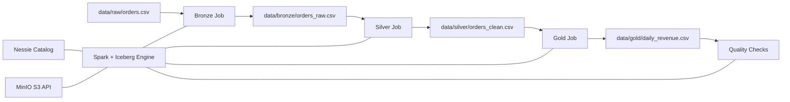

# Architecture

This repository uses a local lakehouse stack designed for portability and clear demos.

- Spark for processing
- Apache Iceberg for table format
- MinIO as S3-compatible object storage
- Nessie as the catalog and data branching layer

## System diagram

## Why this design

- Reproducible: layer outputs are deterministic CSVs for stable test assertions.
- Observable: each stage has explicit schema contracts and quality checks.
- Incremental evolution: SQL demos isolate time travel, schema evolution, merge, and Nessie branch workflows.
- Cloud portability: local components map directly to AWS-managed services.

## Layer responsibilities

- Bronze: raw ingest, minimal interpretation, source-shape preservation.
- Silver: typing/normalization and clean, analysis-ready records.
- Gold: business-oriented aggregations for reporting/consumption.

## Operational posture

- Local quality gate: `make check` for lint, typing, and tests.
- Runtime operability: profile-driven config and structured logging in jobs.
- Integration guardrail: smoke workflow validates Docker services and full pipeline execution.
